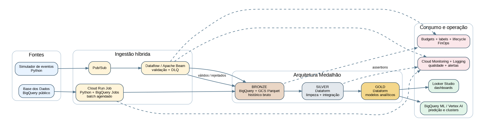

# Tech Challenge - Pipeline Híbrido de Alfabetização no GCP

Link para o video: https://www.youtube.com/watch?v=R7Yg-bACL7w


Este repositório apresenta a solução que eu desenvolvi para o Tech Challenge da Fase 2. O projeto integra dados públicos sobre alfabetização no Brasil, organiza as informações nas camadas Bronze, Silver e Gold e demonstra ingestão batch e streaming no Google Cloud Platform.

A documentação foi escrita de forma simples, como um registro do que eu implementei, das decisões que tomei e dos comandos necessários para reproduzir a demonstração.



## 1. Objetivo

O objetivo foi criar uma pipeline de dados capaz de:

- coletar resultados e metas de alfabetização;
- integrar dados do Brasil, UFs e municípios;
- tratar e validar os registros;
- gerar tabelas analíticas para comparação de metas e resultados;
- simular atualizações em tempo quase real;
- controlar custos durante a demonstração;
- apagar todos os recursos e o projeto GCP no final.

## 2. Arquitetura utilizada

```text
Base dos Dados / BigQuery público
                 |
                 v
Bronze - dados brutos no meu projeto GCP
                 |
                 v
Silver - limpeza, tipos, nulos, chaves e integração
                 |
                 v
Gold - indicadores, metas, evolução, ranking e IA
```

Fluxo streaming:

```text
Publisher Python -> Pub/Sub -> Dataflow -> BigQuery Bronze -> Dataform -> Gold
```

Serviços principais:

| Necessidade | Ferramenta |
|---|---|
| Armazenamento analítico | BigQuery |
| Arquivos Parquet opcionais | Cloud Storage |
| Mensageria | Pub/Sub |
| Streaming | Dataflow + Apache Beam |
| Transformações Silver e Gold | Dataform |
| Infraestrutura como código | Terraform |
| Códigos de ingestão e qualidade | Python |
| Monitoramento | BigQuery Monitoring + Cloud Monitoring |

## 3. Estratégia de baixo custo

A tabela pública `alunos` pode ser grande. Por isso eu não a copio por completo durante a demonstração.

O projeto executa esta estratégia:

1. lê uma pequena porcentagem dos blocos da tabela pública com `TABLESAMPLE`;
2. cria fisicamente `SEU_PROJECT_ID.alfabetizacao_bronze.alunos_amostra`;
3. limita essa amostra a até 500 linhas;
4. reutiliza a tabela nas próximas execuções;
5. Silver e Gold nunca consultam novamente a tabela pública completa de alunos.

A amostra só é recriada quando eu uso conscientemente:

```powershell
python scripts\transferir_dados_inep.py `
  --project-id SEU_PROJECT_ID `
  --sem-parquet `
  --recriar-amostra
```

Também foi definido um teto de 10 GiB por consulta em `MAXIMUM_BYTES_BILLED`. Se a estimativa ultrapassar esse valor, o BigQuery interrompe o job antes da cobrança.

## 4. Fontes de dados

A origem principal é:

```text
basedosdados.br_inep_avaliacao_alfabetizacao
```

Entidades utilizadas:

- `uf`;
- `municipio`;
- `alunos`, somente para criar `alunos_amostra`;
- `meta_alfabetizacao_brasil`;
- `meta_alfabetizacao_uf`;
- `meta_alfabetizacao_municipio`;
- `dicionario`;
- `basedosdados.br_bd_diretorios_brasil.municipio`.

As URLs exatas e as URIs BigQuery estão em:

```text
docs/FONTES_DADOS_URLS.txt
```

## 5. Onde colocar o ID do projeto GCP

Use sempre o mesmo ID de projeto temporário.

| Arquivo ou comando | Campo que deve ser alterado |
|---|---|
| Terminal | `gcloud config set project SEU_PROJECT_ID` |
| `.env` | `GCP_PROJECT_ID=SEU_PROJECT_ID` |
| `.env` | `GCS_BUCKET=SEU_PROJECT_ID-alfabetizacao-lake` |
| `terraform/terraform.tfvars` | `project_id = "SEU_PROJECT_ID"` |
| `terraform/terraform.tfvars` | `bucket_name = "SEU_PROJECT_ID-alfabetizacao-lake"` |
| `dataform/workflow_settings.yaml` | `defaultProject: SEU_PROJECT_ID` |
| SQLs de dashboard | trocar `PROJECT_ID` |
| Scripts de limpeza | informar `-ProjectId SEU_PROJECT_ID` |

O guia completo está em:

```text
docs/ONDE_COLOCAR_PROJECT_ID.txt
```

## 6. Pré-requisitos

Instale no Windows:

- Python 3.10, 3.11 ou 3.12;
- Git;
- Google Cloud CLI;
- Terraform;
- Node.js e npm;
- VS Code;
- Git Bash, instalado junto com o Git.

Faça login:

```powershell
gcloud auth login
gcloud auth application-default login
```

## 7. Criar e preparar o projeto GCP

### Opção A - script de configuração no Git Bash

Este comando cria o projeto quando ele ainda não existe, configura os arquivos locais e habilita as APIs:

```bash
bash scripts/setup_gcp.sh \
  SEU_PROJECT_ID \
  SEU_PROJECT_ID-alfabetizacao-lake \
  SUA_BILLING_ACCOUNT
```

A conta de faturamento pode ser encontrada com:

```bash
gcloud billing accounts list
```

### Opção B - projeto já criado no console

Defina o projeto:

```powershell
gcloud config set project SEU_PROJECT_ID
```

Habilite as APIs:

```powershell
gcloud services enable `
  artifactregistry.googleapis.com `
  bigquery.googleapis.com `
  bigquerystorage.googleapis.com `
  cloudbuild.googleapis.com `
  cloudresourcemanager.googleapis.com `
  cloudscheduler.googleapis.com `
  compute.googleapis.com `
  dataflow.googleapis.com `
  dataform.googleapis.com `
  iam.googleapis.com `
  logging.googleapis.com `
  monitoring.googleapis.com `
  pubsub.googleapis.com `
  run.googleapis.com `
  storage.googleapis.com
```

Copie os arquivos de exemplo:

```powershell
Copy-Item .env.example .env
Copy-Item terraform\terraform.tfvars.example terraform\terraform.tfvars
```

Depois substitua `SEU_PROJECT_ID` nos dois arquivos.

Configure o Dataform:

```powershell
python scripts\configure_dataform.py --project-id SEU_PROJECT_ID
```

## 8. Instalar as dependências no VS Code

```powershell
python -m venv .venv
.\.venv\Scripts\Activate.ps1
python -m pip install --upgrade pip
pip install -e ".[dev]"
pytest
```

## 9. Criar a infraestrutura com Terraform

```powershell
terraform -chdir=terraform init
terraform -chdir=terraform plan
terraform -chdir=terraform apply
```

Digite `yes` quando o Terraform solicitar confirmação.

Recursos principais criados:

- datasets Bronze, Silver, Gold, Monitoring e Assertions;
- bucket Cloud Storage;
- tópico e assinatura Pub/Sub;
- tabelas de streaming;
- contas de serviço;
- Artifact Registry;
- alerta de backlog;
- orçamento opcional.

## 10. Executar a Bronze

### Teste mais simples, somente BigQuery

```powershell
python scripts\transferir_dados_inep.py `
  --project-id SEU_PROJECT_ID `
  --sem-parquet
```

O resultado esperado inclui:

```text
alfabetizacao_bronze.uf
alfabetizacao_bronze.municipio
alfabetizacao_bronze.alunos_amostra
alfabetizacao_bronze.meta_alfabetizacao_brasil
alfabetizacao_bronze.meta_alfabetizacao_uf
alfabetizacao_bronze.meta_alfabetizacao_municipio
alfabetizacao_bronze.dicionario
alfabetizacao_bronze.diretorio_municipio
```

### BigQuery e cópia Parquet

```powershell
python scripts\transferir_dados_inep.py `
  --project-id SEU_PROJECT_ID `
  --bucket SEU_PROJECT_ID-alfabetizacao-lake
```

Na segunda execução, o terminal deve informar que `alunos_amostra` foi reutilizada.

## 11. Executar Silver e Gold

No Git Bash:

```bash
bash scripts/run_dataform.sh
```

O Dataform executa:

- limpeza de dados;
- tratamento de valores ausentes;
- padronização de nomes e tipos;
- normalização de códigos municipais;
- remoção de duplicidades;
- validações de consistência;
- integração entre resultados, metas, UFs e municípios.

Principais tabelas Gold:

- `indicador_municipio`;
- `indicador_uf`;
- `situacao_atual_municipio`;
- `evolucao_temporal`;
- `ranking_municipios`;
- `resumo_brasil`;
- `features_ml`.

## 12. Executar qualidade

```powershell
python -m src.quality.run_checks
```

Os resultados ficam em:

```text
SEU_PROJECT_ID.alfabetizacao_monitoring.quality_results
```

## 13. Demonstrar o streaming

Inicie o Dataflow no Git Bash:

```bash
bash scripts/run_dataflow.sh
```

Publique eventos válidos e inválidos:

```powershell
python -m src.streaming.publisher `
  --count 30 `
  --interval 1 `
  --invalid-rate 0.10
```

Depois da demonstração, pare o job imediatamente:

```bash
bash scripts/stop_dataflow.sh
```

## 14. Consultas para dashboard

Os arquivos estão em:

```text
sql/dashboard/
```

Antes de executar no BigQuery ou Looker Studio, substitua `PROJECT_ID` pelo ID real.

## 15. Apagar tudo depois da apresentação

### 15.1 Simular sem apagar

```powershell
.\scripts\limpar_gcp.ps1 `
  -ProjectId SEU_PROJECT_ID `
  -Bucket SEU_PROJECT_ID-alfabetizacao-lake `
  -DeleteProject `
  -DryRun
```

### 15.2 Apagar recursos e o projeto temporário

```powershell
.\scripts\limpar_gcp.ps1 `
  -ProjectId SEU_PROJECT_ID `
  -Bucket SEU_PROJECT_ID-alfabetizacao-lake `
  -DeleteProject
```

Digite exatamente:

```text
EXCLUIR PROJETO SEU_PROJECT_ID
```

O script:

1. remove o Scheduler;
2. cancela Dataflow;
3. cancela e remove Cloud Run;
4. tenta `terraform destroy`;
5. remove Pub/Sub;
6. remove datasets BigQuery;
7. remove arquivos, versões e bucket;
8. remove Artifact Registry e contas de serviço;
9. solicita a exclusão do projeto.

Confira o estado:

```powershell
gcloud projects list --filter="projectId=SEU_PROJECT_ID lifecycleState:DELETE_REQUESTED"
```

O passo a passo completo está em:

```text
docs/PASSO_A_PASSO_EXECUCAO_E_EXCLUSAO.txt
```

## 16. Estrutura principal

```text
config/                 fontes e estratégia da amostra
dataform/               transformações Silver, Gold e assertions
docs/                   documentação da entrega
scripts/                configuração, execução, streaming e limpeza
sql/dashboard/          consultas para BI
src/batch/              ingestão batch
src/streaming/          produtor e pipeline Dataflow
src/quality/            verificações de qualidade
terraform/              infraestrutura como código
tests/                  testes unitários
```

## 17. Documentos entregáveis
- `docs/deliverables/Manual_Implementacao_Tech_Challenge_Alfabetizacao_GCP.docx`;
- `docs/FONTES_DADOS_URLS.txt`;
- `docs/ONDE_COLOCAR_PROJECT_ID.txt`;
- `docs/PASSO_A_PASSO_EXECUCAO_E_EXCLUSAO.txt`;

## 18. Observação sobre a amostra

A amostra de 500 linhas é suficiente para comprovar a arquitetura, transformações, regras de qualidade, integração e criação das tabelas analíticas. Ela não deve ser usada para tirar conclusões estatísticas nacionais. Em produção, a estratégia poderia ser substituída por ingestão integral, particionada e controlada por orçamento.
